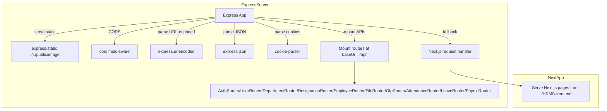

# HRMS

NMCarolina HRMS is a modern Human Resource Management System designed to streamline employee management, payroll processing, attendance tracking, and HR operations.

The system provides a centralized platform where HR teams can manage employees, salary revisions, departments, and payroll efficiently.

# Live Application:
 https://nmcarolina.co.in

 # System Architecture & Runtime Composition

This section describes how the HRMS monorepo is structured and how incoming HTTP requests are handled at runtime. The backend and frontend live alongside each other, with a single Node.js/Express process mounting REST API routers under `/api` and delegating all other routes to Next.js for server-side rendering.

## Monorepo Layout

The repository is organized into two primary packages:

```
root
├─ HRMS-backend
│  ├─ src
│  │  ├─ index.js            # Entry point that boots Express + Next.js
│  │  ├─ jobs/dayEndAttendance.js  # Scheduled cron job
│  │  ├─ modules
│  │  │  ├─ authentication & users
│  │  │  ├─ attendance
│  │  │  ├─ departments & designations
│  │  │  ├─ employees
│  │  │  ├─ file handle
│  │  │  ├─ leave
│  │  │  └─ payroles
│  │  └─ configs
│  └─ package.json
└─ HRMS-frontend
   ├─ src
   │  ├─ app               # Next.js App Router pages
   │  ├─ modules           # Feature modules with pages, hooks, schema
   │  └─ lib
   ├─ cli                  # CLI code generator
   ├─ next.config.ts
   └─ package.json
```

- **HRMS-backend** contains the Express server and day-end attendance cron job.
- **HRMS-frontend** is a Next.js (App Router) application served by the backend process.

## Request Flow

At startup, `HRMS-backend/src/index.js` initializes a single Express application, applies middleware in a fixed order, mounts all API routers under the `/api` base URL, and finally hands off non-API requests to Next.js. The core sequence is:



### Middleware Ordering

1. **Static files**  
   `App.use(express.static("./../public/image"));`  
   Serves images and other assets from the `public/image` directory. 

2. **CORS**  
   ```js
   App.use(cors({
     origin: ["https://nmcarolina.co.in", "http://localhost:8000"],
     methods: ["GET","POST","PUT","PATCH","DELETE","OPTIONS"],
     credentials: true,
   }));
   ```  
   - Allows only the two origins listed  
   - Supports credentialed cookies (`Access-Control-Allow-Credentials: true`) 

3. **URL-encoded body parsing**  
   `App.use(express.urlencoded({ extended: true }));`  
   Parses form data into `req.body`. 

4. **JSON body parsing**  
   `App.use(express.json());`  
   Parses JSON payloads into `req.body`. 

5. **Cookie parsing**  
   `App.use(cookieParser());`  
   Exposes signed cookies on `req.cookies`. 

### Router Mount List

All REST API routers are mounted at the `/api` base URL in the following order:

- AuthRouter  
- UserRouter  
- DepartmentRouter  
- DesignationRouter  
- EmployeeRouter  
- FileRouter  
- OtpRouter  
- AttendanceRouter  
- LeaveRouter  
- PayrollRouter  

Each router defines its own scoped endpoints under `/api`, e.g., `/api/login`, `/api/employees`, `/api/attendance/clockin`, etc. 

### Next.js Fallback

After all API routes, any unmatched request is passed to Next.js:

```js
App.use((req, res) => {
  return handle(req, res);
});
```

Here, `handle` is obtained from `nextApp.getRequestHandler()`, and Next.js serves pages and assets from the `./HRMS-frontend` directory. 

### Server Startup

Finally, the server listens on `PORT` (default 8080) and establishes a MongoDB connection before accepting traffic:

```js
App.listen(PORT, async () => {
  await connectMongoDb();
  console.log(`Server running at http://localhost:${PORT}`);
});
```
